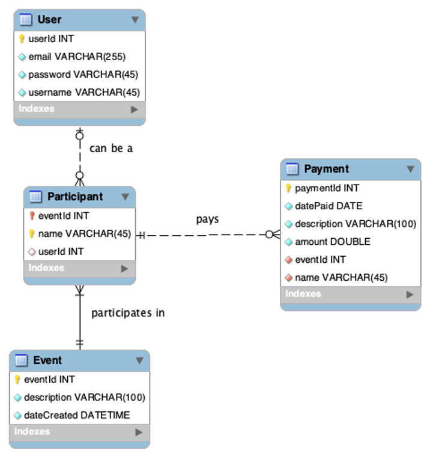

# Propedeuse-opdracht 2023-2024

## Hoe is deze repository ingericht 🔠

- 📄 In de folder `docs` zet je technische documentatie in een `.md`(Markdown) bestandje.
- In dit bestand(`readme.md`) vind je algemene informatie over de repository, zoals hoe je deze kunt gebruiken. Daaronder is informatie gerelateerd tot techniek te vinden 🛠.
- Onder de menu optie `Plan` vind je de pagina `Issue` en daaronder vind je dan de optie `Boards` (te vinden via de balk links 👈🏽) vind je verschillende boards: 
    - Learning stories;
    - Product backlog;
    - Sprint 1 backlog(4 - 17 september);
    - Sprint 2 backlog(18 september - 18 oktober);
    - Sprint 3 backlog(9 oktober - 5 november);
    Probeer de boards goed bij te houden !

Deze boards zijn terug te vinden in de lijst bij de learning stories, deze dient hiervoor opengeklapt te worden om alles te zien. Binnen de boards zijn verschillende overzichten/lijsten gemaakt, zodat je deze kunt gebruiken voor de taken die je nog dient te doen, mee bezig bent of al afgerond hebt. Mocht je scherm te klein zijn, dan kun je naar rechts scrollen om de overige overzichten te zien.

- Op de wiki (ook te vinden via de balk links, `Plan > Wiki`👈🏽) vind je de opdrachtomschrijving.

## Techniek

### Installatie

1. Installeer Visual Studio Code, deze kun je downloaden via  deze  https://code.visualstudio.com/
2. Installeer NodeJS inclusief Node Package Manager (NPM) - https://nodejs.org/en - Installeer huidige LTS-versie `18.x.x`. De NPM heb je nodig voor het project van blok 1 om de code te kunnen laten uitvoeren op je laptop.
3. Installeer en configureer Git, zie voor uitleg de [knowledgebase](https://knowledgebase.hbo-ict-hva.nl/1_beroepstaken/software/manage_and_control/git/installeren/git_installeren/).
4. Maak een SSH Key aan voor Gitlab, deze heb je nodig voor de beveiliging van Gitlab. Zie de [knowledgebase](https://knowledgebase.hbo-ict-hva.nl/1_beroepstaken/software/manage_and_control/git/installeren/git_installeren/#git-koppelen-aan-gitlab) voor uitleg.
5. Clone dit project naar je computer en open het als map in Visual Studio Code.
Dit kun je doen vanuit Gitlab via de knop “Clone” --> "Visual studio code (SSH)", die op de homepagina staat. Hierdoor wordt de applicatie in Visual Studio Code geopend.
1. In Visual studio Code staat in de linker menubalk `Extension`, klik op Extensions(blokjes-icoon). Installeer de plugin ESLint.
2. Ga in de menubalk naar `View" > "Open View...`` en zoek naar "NPM". Dit kun je ook doen door in de linker menubalk op “Explorer” te klikken en het bestand package.json te selecteren. Hierdoor zal onderin NPM Scripts view (paneel) worden getoond. 
3. In het "NPM Scripts" paneel dat opent, klik met rechts op "package.json" en klik op "Run Install", of voer handmatig `npm install` in een terminal uit.
4. Klik nu op de pijl achter "dev", of voer handmatig `npm run dev` in een termimal uit. Via de build tool `Vite` wordt er een lokale server opgestart. Als je de URL in de terminal opent in de browser (http://127.0.0.1:3000) zie
je de webapplicatie. Wijzigingen in code worden realtime (direct) herladen!
1.  Bekijk de map wwwroot en ga op zoek naar de index.html bestand.

## Database

De gegevens over uitjes, deelnemers en uitgaven worden opgeslagen in een database. Een ontwerp voor de database staat al voor je klaar en bestaat uit vier tabellen.

**Om de database in te laden in de HBO-ICT.Cloud kun je het `dokkie_database.sql` bestand gebruiken. Je docent geeft je hier uitleg bij**

Uitleg bij de tabellen:

**Event**

In deze tabel komen de uitjes te staan. De primary key van deze tabel is eventId. De eventId en dateCreated worden automatisch gegenereerd door de database. De gebruiker hoeft dus alleen maar een omschrijving voor een uitje in te vullen.

**Participant**

In deze tabel komen de deelnemers aan het uitje te staan. De eventId is in deze tabel een foreign key. Hierdoor weet je bij welk Event de deelnemer hoort. 
De tabel Participant heeft een composite primary key, bestaande uit twee kolommen: eventId en name. Hierdoor kan elke naam maar één keer voorkomen per Event.

**Payment**

In deze tabel worden de uitgaven opgeslagen die voor het uitje worden gedaan. De primary key paymentId wordt automatisch gegenereerd door de database. De foreign key bestaande uit eventId en name geeft aan welke deelnemer de uitgave heeft gedaan. Aan de eventId kun je ook zien bij welk uitje de uitgave hoort.

**User**

In de eerste versie van Dokkie hoef je nog geen rekening te houden met rechten: gebruikers registreren, inloggen etc. Wil je dit wel maken, dan kun je hiervoor de tabel User gebruiken. De primary key userId wordt door de database gegenereerd. Door bij een Participant aan te geven om welke User het gaat, weet je welke User rechten heeft op een Event.

Wil je meer of andere functionaliteit maken? Dan kun je de database zelf aanpassen.

## Website automatisch uitrollen naar HBO-ICT.Cloud

> Let op! Als je deze repository net hebt laten aanmaken, kan het maximaal een uur duren voordat je HBO-ICT.Cloud project helemaal klaar staat. Dit is een geautomatiseerd proces. Heb je na een uur nog geen project? Vraag dan een docent om hulp!

Je kunt je website automatisch laten uitrollen naar HBO-ICT.Cloud door een paar aanpassingen te maken in het `.gitlab-ci.yml` bestand.

1. Open `.gitlab-ci.yml` bestand met VSCode.
2. Stel `DEPLOY_TYPE` in op `hboictcloud`.
3. Stel `FTP_USERNAME` in op de SFTP Username die je kunt vinden op je [HBO-ICT.Cloud](https://hbo-ict.cloud/).
4. Stel `FTP_PASSWORD` in op de SFTP Password die je kunt vinden op je [HBO-ICT.Cloud](https://hbo-ict.cloud/).

Zorg ervoor dat alle waardes die je invult tussen haakjes staan, net als `FTP_HOST` en `FTP_TARGETPATH` die al voor je zijn ingevuld.

Commit deze wijzigingen, en je website zal automatisch geupload worden naar het subdomein die je kunt vinden op je [HBO-ICT.Cloud](https://hbo-ict.cloud/).

## Debuggen (voor gevorderden)

Hoewel dit een geavanceerde functionaliteit is, raden we iedereen aan zo snel mogelijk hiermee te beginnen. Het kan je ontwikkelplezier gigantisch vergroten! Vraag een docent zeker om uitleg.

1. Klik op het insect-icoontje achter "dev" in het "NPM Scripts" paneel. 
2. Je breakpoint, dit is een punt in code waar het uitvoeren van het programma pauzeert, in VSCode werken nu.

OF

1. Start de webapplicatie via `npm run dev`.
2. Ga in VSCode in de linker zijbalk naar `Run and Debug`. Klik op de groene driehoek om een debug-sessie te starten. 
3. Chrome, deze webbrowser kun je [hier](https://www.google.com/chrome/) vinden, opent en triggered breakpoints in je code.

### Technieken & tools 🛠

- HTML/CSS
- Node Package Manager:
  - Typescript
  - Vite
  - ESLint
- HBO-ICT.Cloud
  - MySQL
